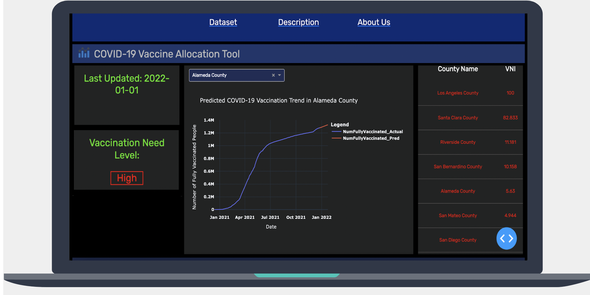

# VaccineNeed.ai by Saahas Kohli and Daniel Fields
A web app that visualizes & predicts COVID-19 vaccination trends, and then projects vaccine "need" by county, helping policymakers decide which geographic areas should be allocated the most vaccines.

## Inspiration

COVID-19 has exposed fundamental weaknesses in emergency response systems worldwide. Although the mRNA vaccine has drastically mitigated the effects of the outbreak, suboptimal distribution and allocation has rendered the vaccine far less effective than it can be. 

At the outset of the pandemic, wealthy nations such as the US reserved millions of vaccine doses, while many low-income countries still do not have enough vaccines to immunize their populations. We realized that oftentimes, vaccines were being allocated to areas whose residents had no intention of using them. 

With its surplus of vaccines, the US has an obligation to distribute them as effectively as possible. Allocating more doses to locations in dire need helps ensure that this precious resource will not be squandered. 

Thus, we built vaccineNeed, a web app that utilizes up-to-date CDC data to visualize county vaccination patterns and predict their future trends with Long Short-Term Memory (LSTM) networks. Based on these predictions, the app generates a Vaccination Need Index (VNI) for each county in our dataset. This will help vaccine distributors prioritize certain areas over others, promoting more responsible methods for administering vaccines now and in the future.

## What it does

VaccineNeed pulls updated vaccination data from the official CDC website and displays vaccination trends for every California county since December of 2020. In the backend, we use LSTM recurrent neural networks to predict future vaccination trends for the next 30 days. We graph the "actual" and "predicted" vaccination trends on our Dash frontend. Using mathematical, derivative-based analysis of the predictions, we determine the relative "vaccine need" of that county in the next 30 days and encapsulate that result in a Vaccination Need Index (from 0 to 100). Also, the app displays a leaderboard of California counties ranked by VNI (the top county on the leaderboard requires the largest proportion of vaccines). 

The web app is updated daily with new data from the CDC website. Thus the website is automatically kept up-to-date with the most recent vaccination trends, resulting in a fully automated and self-updating system.

## How we built it

For the machine learning backend of our project, we utilized a 3-layer LSTM neural network with an average dropout rate of 0.5, implemented to prevent overfitting. We built the model with the tensorflow-keras framework and we additionally used the pandas, numpy, and scipy frameworks for data cleaning and manipulation. 

For the frontend portion of our project, we used Plotly Express and Dash to create an interactive UI that is especially useful for data visualization. Using Dash callbacks, we implemented a dropdown that allows the user to select a given county and immediately see its actual and predicted vaccination trends. On the backend, we applied gradient calculations to our model's predictions, projecting future vaccination rates and determining the VNI for said county. We then displayed the results on our Dash frontend, making a scrollable leaderboard with the VNI's of every California county, allowing the user to quickly compare the levels of "vaccine need" between different counties.

We used Heroku to host our website. A Google Cloud Virtual Machine redeployed the app on Heroku every 24 hours with newly updated LSTM models for each county. The web application was active from November 2021 to January 2022.

## Challenges we ran into

One major obstacle that we ran into initially was the accuracy of our LSTM model. Since LSTMs are quite complex, we struggled to find the optimal balance between different parameters (dropout rate, number of neurons in LSTM layers, batch size, etc.) in order to reduce overfitting and maintain a high testing accuracy. Moreover, retraining the model every day proved a highly time-consuming process when we tried to do it manually. 

## Accomplishments that we're proud of

One of our major accomplishments was determining the ideal LSTM model architecture for our dataset and obtaining a very low RMSE (root-mean-square error). Based on online research, we determined that we had to weaken our model (by increasing the dropout rate and lowering the number of neurons) in order to improve our accuracy, but we eventually realized that for our situation, increasing the potency of the model (decreasing dropout rate and increasing the number of neurons) was more optimal. Our final model architecture is shown below:

In order to resolve the matter of daily updates to vaccination data, we used Google Cloud Platform to obtain a Virtual Machine capable of automatically retraining LSTM models every 24 hours with new data. The VM calculated new predictions and VNIs, updating the Dash frontend in the process. This both expedited and automated the process of daily updates.

We are also proud of how we designed the vaccineNeed interface. Using Dash, we built a user-friendly dashboard of relevant data that serves its purpose effectively.

## What we learned

After mainly using CNNs and ANNs in the past, transitioning to the field of recurrent neural networks was a difficult step. We learned many of the ins and outs of time series forecasting and predictive modeling. Using Dash, we figured out how to create a web app using only Python and CSS, without the use of JavaScript. We realized that Dash is highly useful for quickly creating data visualization interfaces. Finally, we learned how to use Virtual Machines from Google Cloud Platform to speed up the process of training a neural network model.

## What's next for vaccineNeed

In the future, we plan to implement multivariate time series modeling instead of univariate modeling, which we are currently using. This would allow us to account for many more variables that affect "vaccine need" such as case trends, death trends, and vaccination trends of geographically proximate regions. Furthermore, we plan to expand our current model to all US counties, and perhaps other countries as soon as we find the appropriate datasets. We also plan to experiment with other methods of time-series forecasting, such as SARIMAX. Although our LSTM is reliable, non-neural network modeling may be more effective in this situation (with fewer data points and a trend that does not necessarily require the complexity of a deep learning model).
